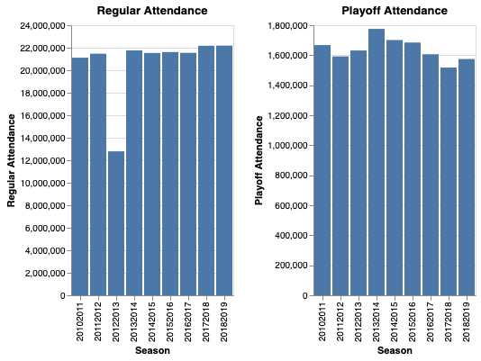

# PyPuck

 [](https://codecov.io/gh/UBC-MDS/pypuck) 

[](https://pypuck.readthedocs.io/en/latest/?badge=latest)

### Purpose & Scope

If you were to try and analyze statistics for your favorite hockey team, or try to predict an outcome of the next match you’d probably browse the internet in search of convenient tools to get the data you want from the NHL website. The pypuck package is designed to allow users ability to get both relevant and historical statistics from the publicly available but as of yet undocumented NHL.com API. There are currently a few other packages that scrape various elements of the NHL.com, our addition builds on what's available.

This project was created as a part of [UBC MDS program](https://masterdatascience.ubc.ca/), and due to it's simplicity can be used as a learning tool for anyone interested in Data Science topics. As of now the package is considered a work-in-progress. We will add to the functionality in the coming weeks and are open to suggestions.

### Team

| [Jarvis Nederlof](https://github.com/jnederlo) | [Xugang Zhong](https://github.com/chuusan) | [Polina Romanchenko ](https://github.com/PolinaRomanchenko)| [Manish Joshi](https://github.com/ManishPJoshi)|
|:------------:|:--------------:|:--------------:|:--------------:|

### Installation:

```
pip install -i https://test.pypi.org/simple/ pypuck
```

### Features

- `player_stats(start_date=None, end_date=None)`:
	- The `player_stats()` function makes an API call to the player summary endpoint on the NHL.com API. The function returns the top 100 player stats for a given date range as sorted by total points.
- `team_stats(start_season=None, end_season=None)`:
	- The `team_stats()` function makes an API call to the team summary endpoint on the NHL.com API. The function returns team seasonal stats for given seasons sorted by total team points.
- `draft_pick(pick_number=None, round_number=None, year=None)`:
	- The `draft_pick(pick_number=None, round_number=None, year=None)` function makes an API call to the drafts summary on the NHL.com API. The function returns information about draft picks for the specified arguments and stores them in a pandas data frame. 
- `attendance(regular=True, playoffs=True, start_season=None, end_season=None)`:
	- The `attendance()` function makes an query to the Attendance API to get the NHL’s seasonal and playoff attendance numbers. The function displays attendance numbers in an Altair chart.


### Python Ecosystem
There are a variety of nhl themed packages created for different purposes. Some of the packages that have similar functionality include [Hockey-scraper](https://github.com/HarryShomer/Hockey-Scraper), [nhlscrapi](https://pythonhosted.org/nhlscrapi/) and [nhl-score-api](https://github.com/peruukki/nhl-score-api). Our function provides functionality in a simple package and serves as a learning tool for package building.  


### Dependencies
Python 3.7 and Python packages:
| Package                                                  	| Minimum Supported Version 	|
|----------------------------------------------------------	|---------------------------	|
| [pandas](https://pandas.pydata.org/)                      | 1.0.1                     	|
| [requests](https://requests.readthedocs.io/en/latest/)    | 2.23.0                    	|
| [altair](https://github.com/altair-viz/altair)            | 3.0.1                     	|


### Documentation
The official documentation is hosted on Read the Docs: <https://pypuck.readthedocs.io/en/latest/>

### Usage Examples

```python
from pypuck import pypuck

pypuck.player_stats(start_date='2019-10-02', end_date='2020-03-10')
```


```python
from pypuck import pypuck

pypuck.team_stats(start_season='19992000', end_season='20102011')
```


```python
from pypuck import pypuck

pypuck.draft_pick(pick_number=1, round_number=None, year=2015)
```


```python
from pypuck import pypuck

pypuck.attendance(regular=True, playoffs=True, start_season=2010, end_season=2019)
```



### Credits
This package was created with Cookiecutter and the UBC-MDS/cookiecutter-ubc-mds project template, modified from the [pyOpenSci/cookiecutter-pyopensci](https://github.com/pyOpenSci/cookiecutter-pyopensci) project template and the [audreyr/cookiecutter-pypackage](https://github.com/audreyr/cookiecutter-pypackage).
